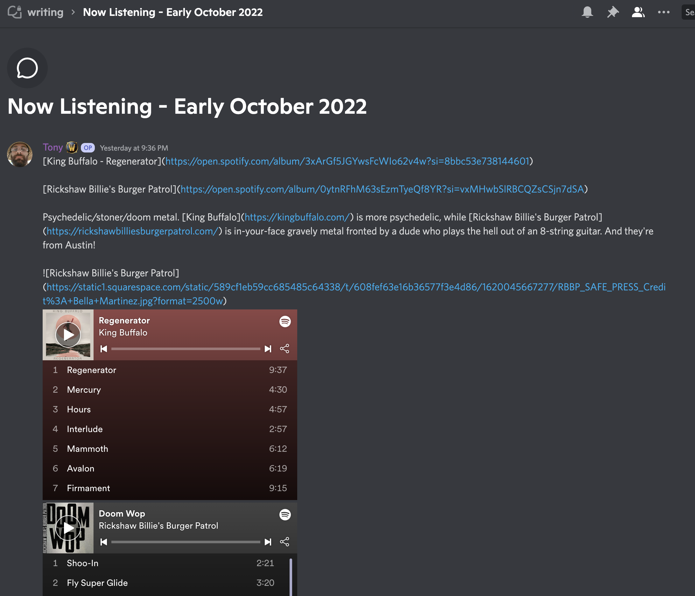
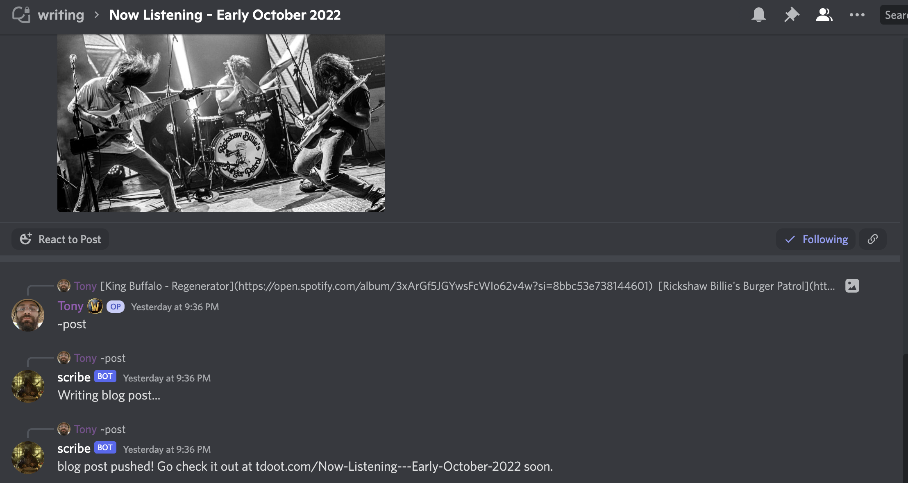

# Discord Forum Post to Hugo Post

This is a [Serenity](https://github.com/serenity-rs/serenity)-powered bot I use to write blog posts for my [Hugo](https://gohugo.io/) site [(tdoot.com)](https://tdoot.com) from Discord.

I found it tedious to open up an editor, write some markdown then commit + push so naturally, I automated all of that.
Also makes it easier to jot some notes down into a forum post on Discord and send when I'm done.

## Workflow:
Add the bot to your guild.

Create a forum post on Discord with a title and some content in the first message.

Reply to the first (threaded) message with `~post`. The bot will take the content of the first message, the forum channel topic, write the contents to a file, then push them to the desired repository.

All options are set through environment variables:

- GIT_REPO: url for the git repository. Example: `git@github.com:tonydelanuez/tonydelanuez.github.io.git`

- REPO_DIR: directory to store the repository. Example: `/var/post-automation/git-repo`

- DISCORD_TOKEN: discord bot token

I recommend setting `GIT_SSH_COMMAND` to pick up your SSH config. Example: `"GIT_SSH_COMMAND="ssh -o IdentitiesOnly=yes -i $HOME/.ssh/id_ed25519_post_automator""`
